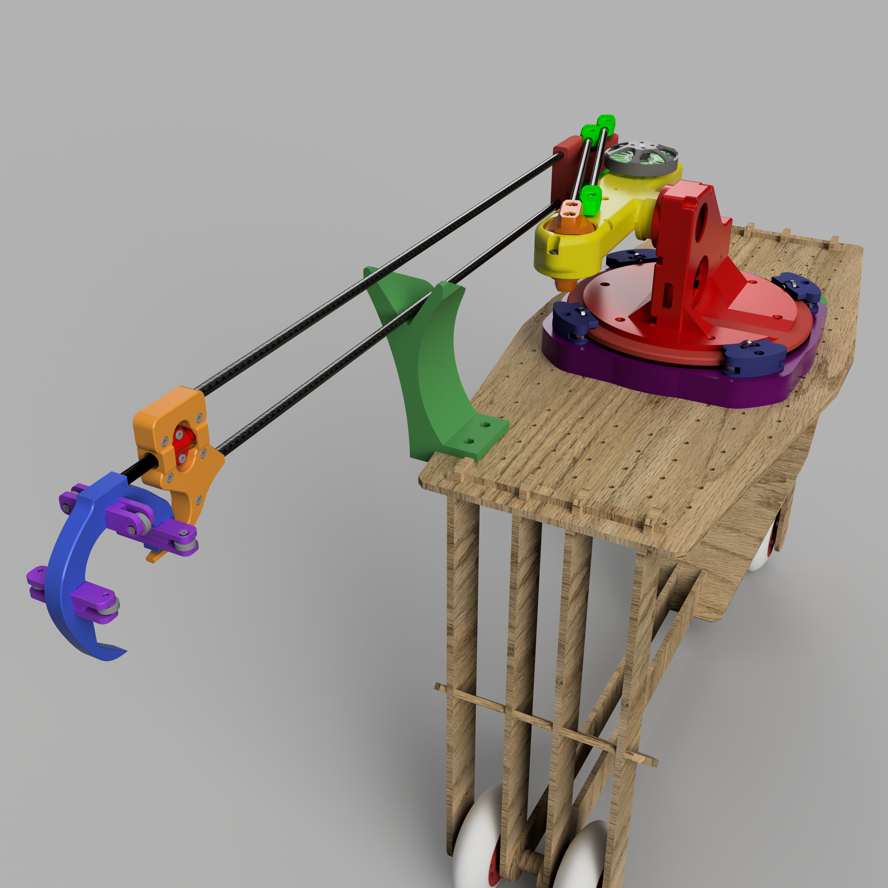

# Stabalizing robot with the use of a robot arm
Open-source hardware and software for arm that can stabalize a locomotive robots. 

## Mechanics

## Elctronics

## Software

## Authors
Florian Dendooven  
Arno Lehouck  
Jasper Vandenameele-Lepla
